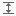
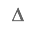
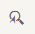

<!-- loio5e6581e17b3741b99117dbadc636c48e -->

# Adjusting Individual Parameters Using Expert Theming

If you want to change more than the *Quick* panel could offer, you can use expert theming to make fine-tuned adjustments to your theme.

<a name="loio5e6581e17b3741b99117dbadc636c48e__prereq_N10015_N10012_N10001"/>

## Prerequisites

You have selected a theme as the base of your theme and an application for the preview.

See [Creating a New Theme](creating-a-new-theme-f987d5f.md) and [Adding Target Content](adding-target-content-6f99f7f.md).

<a name="loio5e6581e17b3741b99117dbadc636c48e__context_N10015_N10012_N10001"/>

## Context

Expert theming allows a finer grain of changes than Quick theming, supporting both cross UI technology parameters and UI technology specific parameters. Expert parameters may evolve over time, potentially requiring maintenance after upgrades.

## Procedure

1.  On top of the side panel on the right, choose *Expert*.

2.  Search for the parameters you need to change.

    You have the following filter and search options:

    -   Filter for parameters that have the same type. The following categories are available:

        ****

        <table>
        <tr>
        <th valign="top">

        Category Icon
        
        </th>
        <th valign="top">

        Description
        
        </th>
        </tr>
        <tr>
        <td valign="top">
        
        
        
        </td>
        <td valign="top">
        
        Shows parameters with color value.
        
        </td>
        </tr>
        <tr>
        <td valign="top">
        
        
        
        </td>
        <td valign="top">
        
        Shows parameters related to typography.
        
        </td>
        </tr>
        <tr>
        <td valign="top">
        
        
        
        </td>
        <td valign="top">
        
        Shows parameters with dimension value \(em, px, pt, % etc\).
        
        </td>
        </tr>
        <tr>
        <td valign="top">
        
        
        
        </td>
        <td valign="top">
        
        Shows parameters representing an image.
        
        </td>
        </tr>
        </table>
        
    -   Choose  to show changed parameters only.
    -   Choose  to switch on the control picker mode.

        When you hover over an element in the preview area, it will be highlighted. When you select the element, only parameters that are related to the selected element are displayed.

    -   Choose  to switch to the tag view.

        A list of toggle links with filter categories is displayed. Select a link to add all available parameters with that tag to the parameter list. Selecting additional links restricts the list of parameters displayed.

    -   Use the search input field to search for a string in the parameter name.

        For example, enter the search string `disabled` to filter for all parameters that define the visual appearance of disabled controls.

3.  Change the parameter values according to your needs.

4.  To switch between parameters of standard and contrast areas of themes based on SAP Belize, toggle the contrast switch in the value column header.

