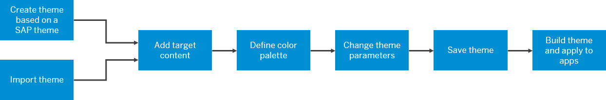

<!-- loio79b3063c98484573a9d7a9b9bfb2bfae -->

# Create Themes - End to End Flow

Administrators use the UI theme designer for creating and building themes to apply to SAPUI5 apps as well as an SAP Fiori launchpad.

In this section we provide step by step instructions showing you how to create a theme from beginning to end in order to brand your apps.

The overall process is as follows.

Hover over a shape for an explanation, click the shape for more information.

<a name="loio79b3063c98484573a9d7a9b9bfb2bfae__section_znd_ndf_l2b"/>

## Summary

You perform the following major steps to build a theme using the UI theme designer:

1.  Launch the UI theme designer, and select an SAP theme as the basis for your custom theme using the *Create Theme* wizard.

    > ### Note:  
    > You can also import an existing theme and edit it by carrying out the steps below.

2.  Add target content for the preview.
3.  \(Optional\) Define palette parameters for reuse.
4.  Adjust the theme that you created in the wizard as follows.
    1.  Change basic theme parameters.
    2.  \(Optional\) Change technology-specific parameters.
    3.  \(Optional\) Add custom LESS or CSS.

5.  Save your theme.
6.  Build and publish your theme and apply it to your apps.

