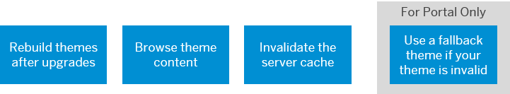

<!-- loiobd27e543f4ac42828c60fc3fcb63d0ac -->

# Manage Themes

Administrators manage their custom themes after creating them in the UI theme designer.

Since themes are client-specific, you need to use the same client to edit and maintain themes.

Here are links to the activities you can do when managing your themes:

