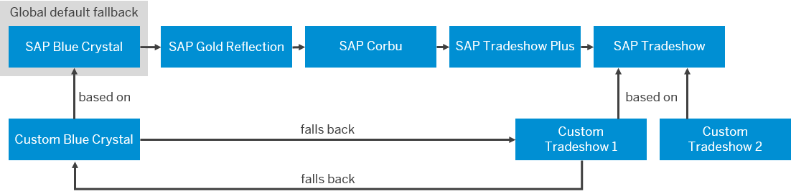

<!-- loio24abdb6eb8c44a9db563016ef69cc76a -->

# Theme Fallback

The theme fallback mechanism checks if a theme can be applied to an application and selects a fallback theme if the specified theme is not valid.

> ### Note:  
> Whether the fallback theme configuration is supported depends on the theming repository connected to the UI theme designer. Currently only the Portal theme repository supports the theme fallback mechanism. For more information, see SAP Portal documentation at *http://help.sap.com/netweaver* \> *SAP NetWeaver Portal* \> *Managing the Portal* \> *System Administration* \> *Configuring the Display of Portal Content* \> *Working with Portal Themes* \> *Working with the UI Theme Designer* \> *Fallback Themes*.

Whether a given theme is supported by an application depends on the underlying UI technology and its version. The theme fallback mechanism automatically detects a valid theme for an application. A default fallback chain of SAP standard themes is used by the fallback mechanism. In addition, you can define a chain of custom themes as fallback themes.

A theme is valid if it meets the following criteria:

-   It exists in the repository for the requested framework and library.
-   The requested CSS file is available and not suppressed \(for example, SAP Blue Crystal is not supported by Internet Explorer 9 and lower version because they do not support standards mode\).
-   It has been built at least once \(the CSS file exists\).
-   It is supported by the UI technology.
-   Its source version is equal or larger than the requested minimum version.

To detect a valid theme for an application, the fallback mechanism performs the following steps:

1.  The mechanism tries to find the theme that was configured to be used for the application.
2.  If the theme is not valid, the chain of themes that were defined as fallback themes for the configured theme is checked.

    If no fallback themes are defined, this step is skipped.

3.  If no valid theme is found, the mechanism checks the validity of the standard SAP themes on which the custom themes traversed in step 2 are based.

4.  If no valid theme is found, the chain of SAP standard themes is checked, starting with the global default theme \(SAP Blue Crystal\).

## Example

-   **Case 1: No Fallback**

    A custom theme \(`Custom Tradeshow 1`\) based on the SAP standard theme SAP Tradeshow is configured to be used for Portal pages. A custom theme \(`Custom Blue Crystal`\) based on SAP Blue Crystal is configured as its fallback theme.

    When the Portal page is loaded, the theme fallback mechanism first checks if the configured theme `Custom Tradeshow 1` is a valid theme for Portal pages. If yes, the Portal page will be displayed with this theme.

-   **Case 2: Fallback to Custom Theme**

    In this case, the same themes are configured \(`Custom Tradeshow 1` with `Custom Blue Crystal` as fallback theme\). This time, the configured theme should be applied to an SAPUI5 application that is embedded in the Portal page.

    The configured theme cannot be loaded because `Custom Tradeshow 1` is based on SAP Tradeshow, which is not supported by SAPUI5. Therefore, the theme fallback mechanism checks if there is a valid fallback theme. The configured fallback theme `Custom Blue Crystal` is supported by SAPUI5 and is applied to the application.

-   **Case 3: Fallback to SAP Standard Theme**

    `Custom Tradeshow 1` with `Custom Blue Crystal` as fallback theme are configured for an SAPUI5 application embedded in the Portal. However, the custom themes have not been built yet and are therefore not valid.

    Since the requested theme `Custom Tradeshow 1` is not supported by SAPUI5, the fallback mechanism first checks the custom fallback themes. Since there is no valid custom fallback theme, the mechanism checks the validity of the standard SAP themes on which the custom themes traversed in the previous step are based. It will first try to fall back to SAP Tradeshow. Since this theme is not supported by SAPUI5, it will fall back again to SAP Blue Crystal, which can be applied to the SAPUI5 application.

-   **Case 4: Fallback to Global Fallback Theme**

    `Custom Tradeshow 2` is configured for an SAPUI5 application that is embedded in a Portal page. In this case, no custom fallback themes are defined.

    The mechanism will first try to fall back to the SAP standard theme on which the configured theme is based. Since SAP Tradeshow cannot be loaded for SAPUI5, the mechnism will fallback to the global default theme SAP Blue Crystal.

