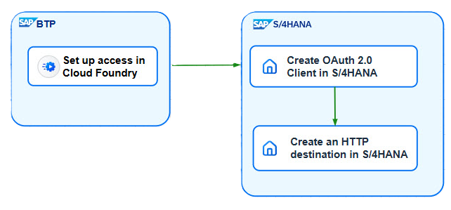

<!-- loio3ccb78c6f0704016b420cf0d0fc82fa4 -->

# Integrating SAP BTP, Cloud Foundry Themes with SAP S/4HANA

You can configure your SAP S/4HANA system to consume custom themes directly from the SAP BTP, Cloud Foundry environment.

## Enabling Remote Theming

Apart from using custom themes from the local UI theme designer, you can also access them from a Cloud Foundry environment. This approach offers several advantages:

-   The latest UI theme designer features are available in the Cloud first.
-   With local theming, you must rebuild custom themes after each UI5 or Unified Rendering framework update. This is not required when using theming data from Cloud Foundry.

The process of enabling theming from SAP BTP, Cloud Foundry involves several key steps:

1.  Set up access to the theming infrastructure in your Cloud Foundry account.
2.  Create an OAuth 2.0 Client and an SM59 connection in SAP S/4HANA to your Cloud Foundry account.
3.  Enter the SM59 ID in SPRO customizing.
4.  After successful setup, your SAP S/4HANA system retrieves theming information directly from Cloud Foundry.

The next sections describe these steps in detail.

## Setting Up the Environment in SAP BTP, Cloud Foundry

The first step for enabling remote theming involves preparing your Cloud Foundry environment. Begin by setting up the UI theme designer environment in SAP BTP as described in [Portal Scenario](https://help.sap.com/docs/btp/ui-theme-designer/portal-scenario).

To obtain the required connection information for the next steps, you can create a service key in Cloud Foundry:

1.  Navigate to the space of the Cloud Foundry environment subaccount. Go to *Instances and Services*, then to *Instances* and select the theming service.
2.  Create a service key. For more information, see [Creating Service Keys](https://help.sap.com/docs/btp/sap-business-technology-platform/creating-service-keys?version=Cloud).
3.  Open the service key and copy the following information:

    a. `uri`

    b. `uaa.clientid`

    c. `uaa.url`

    d. `uaa.clientsecret`

## Create OAuth 2.0 Client in SAP S/4HANA

Once the Cloud Foundry environment is configured and service key details are noted, proceed to set up the necessary authentication in your SAP S/4HANA system. This client will be used for secure communication with Cloud Foundry.

1.  Start SOAUTH2\_CLIENT transaction in your AS ABAP system.
2.  Select *Create* to create a new OAuth 2.0 Client profile.
3.  Select the profile `/UI5/THEME_REMOTE`.
4.  Enter the value of `uaa.clientid` from the service key as the OAuth 2.0 Client ID, then select *OK*.
5.  Enter the value of `uaa.url` as the *Token Endpoint*, making sure to omit the leading `https://` \(as it will not work otherwise\), and then append `/oauth/token`.
6.  Switch to the *Client Authentication* tab and select *Form Fields* as *Authentication Method*. Select the *Edit* button and enter `uaa.clientsecret` as value.
7.  In *PSE for HTTPS/TLS Communication* select *DEFAULT* for *SSL Client PSE*.
8.  Switch to the *Grant Type* tab and select *Client Credentials*.
9.  Save.
10. **Optional**: To test the token retrieval, select *Token* in the header bar. Select `Request Token`. In `Access Token` you will see a similar message: *Valid, expired in 29 minutes*.

## Create a New Destination in SAP S/4HANA

With the OAuth 2.0 Client established, create a new HTTP destination in SAP S/4HANA to connect to the Cloud Foundry theming service. This destination will utilize the OAuth client for authentication.

1.  Start transaction SM59.
2.  Create a destination of type G *HTTP Connection to External Server* with a name and description of your choice.
3.  Go to the *Technical Settings* in the details of the destination and enter:

    a. from the service key the `uri` value as Host, omitting `https://` and any path; otherwise, it will not work.

    b. the path prefix `/themeroot/v1`.

4.  Switch to the *Logon & Security* tab and select *OAuth Settings*.
5.  Select the `/UI5/THEMING_REMOTE` profile and choose *Save*.
6.  Save everything.

## Configure a Destination for Custom Themes

Finally, activate the remote theming scenario in your SAP S/4HANA:

1.  Start the customization via transaction SPRO.
2.  Go to the *SAP Reference IMG*.
3.  Navigate to *ABAP Platform* \> *UI Technologies* \> *UI Theme Designer* \> *Select the Theming Scenario*.
4.  In the customization settings, choose the *Remote* theming scenario. Enter the ID of the SM59 destination, as described in the previous section, and select *Save*.

    Themes are now sourced from your Cloud Foundry account.

