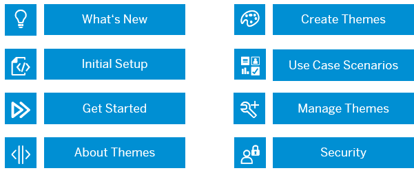

<!-- loioda5decc9979944fa8dccaa04aa88594a -->

<link rel="stylesheet" type="text/css" href="css/sap-icons.css"/>

# What is UI Theme Designer

Apply your corporate branding to applications based on SAP UI technologies. 

The UI theme designer is a browser-based tool for cross-theming scenarios. Use it to easily build your corporate identity themes by modifying one of the theme templates provided by SAP. For example, you can change the color scheme, or add your company logo. The tool is targeted at different user groups, including developers, visual designers, and administrators. It is offered with SAP Build Work Zone, standard edition and SAP Build Work Zone, advanced edition.

Use the UI theme designer across different UI technologies, such as SAPUI5, UI5 Web Components, Unified Rendering included in Web Dynpro ABAP and SAP GUI for HTML, SAP Mobile Start and Fundamental Library Styles, to build your custom theme with an easy to use WYSIWYG editor.

## Environment

The UI theme designer runs in the following environments:

-   SAP BTP Cloud Foundry environment

-   SAP BTP Neo environment

-   ABAP Platform

You can integrate the UI theme designer from SAP BTP Cloud Foundry environment with:

-   SAP S/4HANA Cloud Public Edition

-   SAP BTP ABAP environment

-   SAP BTP Kyma environment

## Features

<dl>
<dt><b>

Cross-technology theming

</b></dt>
<dd>

Develop a single theme by customizing a standard SAP theme template and apply it to applications developed with various SAP UI technologies.

</dd><dt><b>

WYSIWYG editor with preview pages

</b></dt>
<dd>

Modify theming parameters and immediately preview how your theme will appear when applied to an application. Review your changes across different technologies using technology-specific preview changes.

</dd><dt><b>

Different level of theming

</b></dt>
<dd>

The UI theme designer follows a top-down approach, starting with quick customizations, such as adjusting the logo and main colors, and extending to more detailed control adjustments.

</dd><dt><b>

Color palette for reuse

</b></dt>
<dd>

Define a set of key color parameters that reflect your corporate branding, making it easy to replace SAP's default theming values with your own.

</dd><dt><b>

Theme sets

</b></dt>
<dd>

Define light, dark, and high-contrast appearances for your theme to adjust the theme automatically during the day in sync with your system.

</dd><dt><b>

Export and import themes

</b></dt>
<dd>

Export and import your theme to seamlessly apply it across different environments.

</dd><dt><b>

Migrate your theme

</b></dt>
<dd>

Upgrade your theme to the latest theme for SAP applications to ensure access to new features.

</dd><dt><b>

Theme fallback \(SAP BTP only\)

</b></dt>
<dd>

Define a fallback theme to be used when the primary theme cannot be applied to an application.

</dd><dt><b>

Automatic themes upgrade \(SAP BTP only\) 

</b></dt>
<dd>

The theming service automatically provides the theme for different technology versions on-demand.

</dd><dt><b>

Transporting themes 

</b></dt>
<dd>

Administrators can easily transport themes in the ABAP Platform between different ABAP on-premise systems and on SAP BTP Cloud Foundry between landscapes and subaccounts.

</dd><dt><b>

Feedback 

</b></dt>
<dd>

We'd love to hear your thoughts on the UI theme designer. Share your feedback to hep us enhance the theming experience.

</dd>
</dl>

<a name="loioda5decc9979944fa8dccaa04aa88594a__section_oyj_cmr_j5b"/>

## Overview Video

Watch this video to get an [overview of UI theme designer](https://video.sap.com/media/t/1_7tm35v8p).

### GitHub Feedback

> ### Tip:  
> The English version of this guide is open for contributions and feedback using GitHub. This allows you to get in contact with responsible authors of SAP Help Portal pages and the development team to discuss documentation-related issues. To contribute to this guide, or to provide feedback, choose the corresponding option on SAP Help Portal:
> 
> -   :pencil2:: Contribute to a documentation page. This option opens a pull request on GitHub.
> 
> -    Feedback: Provide feedback about a documentation page. This option opens an issue on GitHub.
> 
> 
> You need a GitHub account to use these options.
> 
> More information:
> 
> -   [Contribution Guidelines](https://help.sap.com/docs/open-documentation-initiative/contribution-guidelines/readme.html)
> 
> -   [Introduction Video: Open Documentation Initiative](https://www.youtube.com/watch?v=WJ0oarMlVW4)
> 
> -   [Blog Post: Introducing the Open Documentation Initiative](https://blogs.sap.com/2021/05/20/introducing-the-open-documentation-initiative/)

<a name="loioda5decc9979944fa8dccaa04aa88594a__section_yvl_sgp_mdc"/>

## Further Information

-   Check out the [SAP Fiori for Web Design Guidelines](https://experience.sap.com/fiori-design-web/) to get information about the SAP Fiori Design System, UI Elements, and the Designer Toolkit.

-   Be part of the [SAP UI theme designer community](https://pages.community.sap.com/topics/ui-theme-designer)

