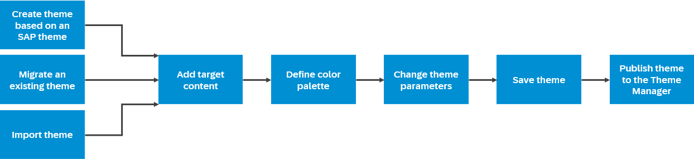

<!-- loio0d2d662651d443288b5dce463acf4193 -->

# Create Themes — End to End Flow

Administrators create and design themes for Portal sites and apps using the UI theme designer.

In this section we provide detailed step by step instructions showing you how to create a new theme or change an existing one in order to brand your sites and apps.

The overall process is as follows:

Hover over a shape for an explanation, click the shape for more information.

<a name="loio0d2d662651d443288b5dce463acf4193__section_gcm_b4y_y3b"/>

## Summary

You perform the following major steps to build a theme using the UI theme designer:

1.  Launch the UI theme designer, and select an SAP theme as the basis for your custom theme using the *Create a New Theme* wizard.

    > ### Note:  
    > You can also import an existing theme and edit it by carrying out the steps below.

2.  Add target content for the preview.
3.  \(Optional\) Define palette parameters for reuse.
4.  Adjust the theme that you created in the wizard as follows.
    1.  Change basic theme parameters.
    2.  \(Optional\) Change technology-specific parameters.
    3.  \(Optional\) Add custom LESS or CSS.

5.  Save your theme.
6.  Publish your theme to make it available for assigning to sites and apps.

