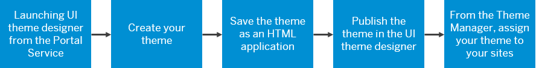

<!-- loio2292463f96774c599fc2cbdc6d6bb453 -->

# Using Themes in Portal Sites

Administrators can create a theme in the Portal by launching UI theme designer directly from an SAP Fiori launchpad or freestyle site.

Launching the UI theme designer directly from your Portal site via SAP Fiori launchpad configuration cockpit is recommended. Why? Because in this way, when you publish a theme in the UI theme designer, the theme is automatically registered with the portal's Theme Manager.

From here you can easily manage your themes and assign them to any site in your subaccount as well as make the themes available for end user selection.

<a name="loio2292463f96774c599fc2cbdc6d6bb453__section_qdy_d1v_c2b"/>

## The overall process is as follows:

Click the shapes for more information.

1.  Access the UI theme designer from the SAP Fiori launchpad configuration cockpit.

    For more information, see [Launching UI Theme Designer from SAP Fiori Launchpad Configuration Cockpit on Cloud Foundry](launching-ui-theme-designer-from-sap-fiori-launchpad-configuration-cockpit-on-cloud-found-f69af60.md).

2.  Create your theme.

    For more information, see [Creating a New Theme](../creating-a-new-theme-72c730b.md).

3.  Save your theme as an HTML5 application.

    For more information, see [Saving Themes](../saving-themes-c99d9df.md).

4.  Publish your theme in the UI theme designer.

    By doing this, you are automatically registering your theme with the Theme Manager in your SAP BTP subaccount. For more information, see [Publishing Themes](../publishing-themes-f4889a4.md).

5.  Now you can access the Theme Manager to manage your theme and assign it to your Portal site \(launchpad or freestyle\). At runtime, end users will also be able to select this theme from a list of available themes when they want to change the branding of their site.

    > ### Note:  
    > You access the Theme Manager through the SAP Fiori launchpad configuration cockpit \(for launchpad sites\) or through the Site Designer \(for freestyle sites\).

