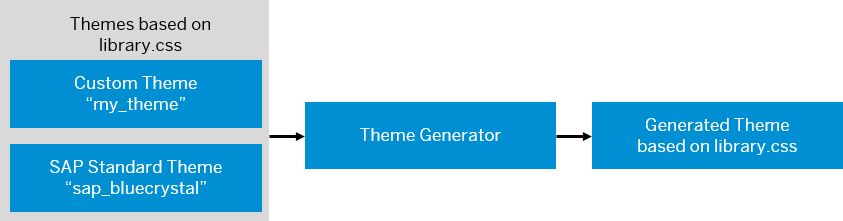

<!-- copy3b7df83134e1426fb4def49abe0a0e34 -->

# Basics of Theming

This section describes the basic concepts that administrators should know when creating themes with the UI theme designer.


<a name="copy3b7df83134e1426fb4def49abe0a0e34__section_sfw_tp4_12b"/>

## What is a custom theme?

A theme defines the visual appearance of an application, including font size and type, colors of UI controls and background images. It can be applied to an application to suit the purpose, topic, or tastes of different users.

In the context of UI theme designer, a custom theme is a new theme that is adapted from an SAP standard theme and includes changes according to how a particular customer wants to brand their site. This includes changes to theme parameter values, images, and other resources. The UI theme designer generates the CSS for the custom theme. The theme can then be deployed to the target server along with any uploaded images or other resources. The degree of support for the custom theme depends on the features used. Themes may support one or more UI technologies.


<a name="copy3b7df83134e1426fb4def49abe0a0e34__section_o2s_3q4_12b"/>

## About the source language LESS

The UI theme designer uses the style sheet language LESS \(Leaner CSS\), **version 1.63**, as the source file format for theming data. LESS extends CSS with dynamic behavior such as variables, mixins, operations, and functions. These techniques allow you to make CSS that is more maintainable, themable, and extendable.

With LESS, you can define variables centrally and reuse them throughout the style sheet. You simply use an @ sign to define a variable and a colon to assign its value:

```
@myColor:value
```

Rather than repeating the value, you can reference the variable. During the CSS build process, the values of the variables are inserted into the output CSS file.

In addition, LESS allows operations and functions. Operations allow addition, subtraction, division, and multiplication of property values and colors, which can be used to create relationships between properties. Functions allow the manipulation of values. For example, you can define a color by desaturating another color like this:

```
@myColor:desaturate(@color1, 10%); 
```


<a name="copy3b7df83134e1426fb4def49abe0a0e34__section_ppd_vp4_12b"/>

## How the UI theme designer uses LESS

The UI theme designer exposes a set of LESS-based theming parameters in the *Quick*, *Detailed*, and *Expert* tab. Theming parameters can be color values, text sizes, icons, background images, and more. For example, the *Quick* tab offers the theming parameter `@sapHighlightColor`.

Changed parameters are stored in the custom theme. In the theme build process, the changes to the SAP standard theme are concatenated. The theme generator substitutes all references to the CSS variable by the current value of this variable. Thus, the final CSS contains the redefined properties \(for example a different highlight color\).

Since custom themes only store the custom changes, future updates to the base themes will propagate to the custom theme parameters that have not been changed.

  

**Related Information**  


[http://lesscss.org/](http://lesscss.org/)

[http://less2css.org/](http://less2css.org/ "Use this page to enter LESS code and display the corresponding CSS code.")

[Typical LESS Functions](https://help.sap.com/viewer/46ace68cf57b452c900d2bcb88018c52/2303/en-US/e1a5b2de087645c0a35f764e0d259df0.html "The following is a list of typical LESS functions for colors.") :arrow_upper_right:

