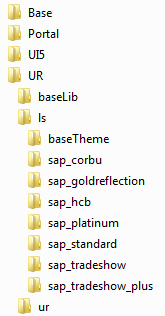

<!-- copy0989497d60fe4d5db2b3b22be38e9473 -->

# Structure of Theming Files

The files defining custom themes and SAP standard themes are stored in the theme repository.

The folders containing these files have the following structure:

-   Framework

    At the top level, you can find a folder for each framework \(for example SAPUI5, Unified Rendering, NWBC\).

    Unified Rendering is a rendering technology that is generally supported and used by Web Dynpro ABAP, Floorplan Manager, and other UI technologies. It has two versions: Unified Rendering Classic and Unified Rendering Light Speed.

    The `Base` folder contains data that is shared by all frameworks \(e.g. the SAP main colors and sets of web application icons\).

-   Library

    Each framework folder contains folders for the libraries. A library defines a set of controls and their rendering.

    Unified Rendering contains, for example, Unified Rendering Light Speed \("ls"\) and Unified Rendering Classic \("ur"\).

    SAPUI5 contains, for example, sap.ui.commons \(controls like TextField and Button\) and sap.m \(controls for mobile devices\).

    The `baseLib` folder provides the possibility to store data which is common for all libraries.

-   Theme

    Each library folder contains folders for the themes with the corresponding LESS files. The folders for the themes delivered by SAP have the prefix "sap\_". The title of the custom folders is the ID that was entered when saving the theme.

    The base theme is the theme from which each theme inherits directly or indirectly.

The following graphic illustrates the structure of theming files:

