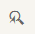

<!-- loio5e6581e17b3741b99117dbadc636c48e -->

# Adjusting Individual Parameters Using Expert Theming

If you want to change more than the *Quick* or *Detailed* panels could offer, you can use expert theming to make fine-tuned adjustments to your theme.

<a name="loio5e6581e17b3741b99117dbadc636c48e__prereq_ycq_th3_3yb"/>

## Prerequisites

-   You have created a theme or selected an existing one and opened it for editing. For more information, see [Creating a New Theme](https://help.sap.com/viewer/09f6818d8e064537973102d6289e2aca/Cloud/en-US/72c730b60f6b41b0bfed63b474007b51.html "Administrators create themes using the Create a New Theme wizard in the UI theme designer.") :arrow_upper_right:.

-   You have added preview pages and selected one of them. For more information, see [Adding Preview Pages](https://help.sap.com/viewer/09f6818d8e064537973102d6289e2aca/Cloud/en-US/8af60d39007a4847919f8dcbbb7a7b16.html "Administrators or other theme developers can add preview pages to the UI theme designer editor to preview changes they make to a theme. UI theme designer comes with a set of predefined preview pages for various SAP UI technologies.") :arrow_upper_right:.

<a name="loio5e6581e17b3741b99117dbadc636c48e__context_N10015_N10012_N10001"/>

## Context

Expert theming allows a finer grain of changes than Quick and Detailed theming. These parameters can influence many elements if they are very generic \(e.g. Quick parameters like the default text color\), only some parameters of a few controls \(e.g. the different button colors\), only parameters of one control or no other parameters at all.

<a name="loio5e6581e17b3741b99117dbadc636c48e__steps_rl1_m4r_y3b"/>

## Procedure

1.  On top of the side panel on the right, choose *Expert*.

2.  Search for the parameters you need to change.

    You have the following filter and search options:

    -   Filter for parameters that have the same type. The following filters are available:

        ****

        <table>
        <tr>
        <th valign="top">

        Filter Icon
        
        </th>
        <th valign="top">

        Description
        
        </th>
        </tr>
        <tr>
        <td valign="top">
        
        
        
        </td>
        <td valign="top">
        
        Shows parameters with color value.
        
        </td>
        </tr>
        <tr>
        <td valign="top">
        
        
        
        </td>
        <td valign="top">
        
        Shows parameters related to typography.
        
        </td>
        </tr>
        <tr>
        <td valign="top">
        
        
        
        </td>
        <td valign="top">
        
        Shows parameters with dimension value \(em, px, pt, % etc.\).
        
        </td>
        </tr>
        <tr>
        <td valign="top">
        
        
        
        </td>
        <td valign="top">
        
        Shows parameters representing an image.
        
        </td>
        </tr>
        </table>
        
    -   Choose  to show changed parameters only.
    -   Choose  to find parameters with errors.
    -   Choose  to switch on the element picker mode.

        When you hover over an element in the preview area, it is highlighted. When you select the element, only parameters that are related to the selected element are displayed.

        > ### Note:  
        > Element inspection is only possible if the preview page and the UI theme designer share the same origin.

    -   Choose  to switch to the tag view.

        A list of toggle links with filter categories is displayed. Select a link to add all available parameters with that tag to the parameter list. Selecting additional links restricts the list of parameters displayed.

        > ### Note:  
        > When you select a control preview page, you find the most relevant parameters when you select the corresponding tag \(e.g. select tag *Button* for the Button preview page\).

    -   Use the search input field to search for a string in the parameter name.

        For example, enter the search string `disabled` to filter for all parameters that define the visual appearance of disabled controls. You can enter the name or parts of a name of parameters.

        To search for more than one name \(part\), you can concatenate them with the vertical bar |. An example: To search for parameters containing the words `background` or `base`, please enter `background|base`.

    -   You can find more possibilities to find the relevant parameters in  <?sap-ot O2O class="- topic/xref " href="0980cc66dfb54ca0923e25bf64812085.xml" text="" desc="" xtrc="xref:3" xtrf="file:/home/builder/src/dita-all/wrb1756113250382/loio224f0e792494418c8c4351fa75099a04_en-US/src/content/localization/en-us/5e6581e17b3741b99117dbadc636c48e.xml" output-class="" outputTopicFile="file:/home/builder/tp.net.sf.dita-ot/2.3/plugins/com.elovirta.dita.markdown_1.3.0/xsl/dita2markdownImpl.xsl" ?> .

3.  If you click on a parameter name in the list, you get a popup with additional information about the parameter. Here you find the name, a description, the current value, the last saved value and the original value, some more information about the parameter, and the tags which are assigned to this parameter. You have the possibility to copy the parameter name into the clipboard and you can restore the value to the last saved one or to the original value.

4.  Change the parameter values according to your needs.

