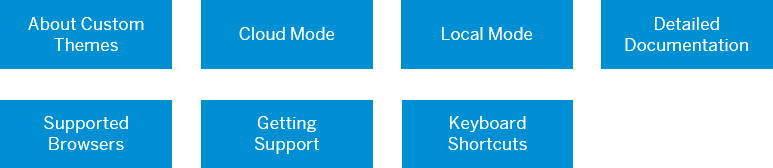

<!-- loio827fd85f82b446cba35c2725d8830531 -->

# Get Started

This section helps administrators to become familiar with information that is required before using UI theme designer.

<a name="loio827fd85f82b446cba35c2725d8830531__section_bzq_ctm_22b"/>

## Overview

The UI theme designer is a browser-based tool for cross-theming scenarios. Use it to easily build your corporate identity themes by modifying one of the theme templates provided by SAP. For example, you can change the color scheme, or add your company logo. The tool is targeted at different user groups, including developers, visual designers, and administrators.

To get an impression of how UI theme designer helps you provide a seamless and delightful experience for your users across different UI technologies, watch this video:

[UI Theme Designer - Brighten Your Business](https://www.youtube.com/watch?v=R-dh5j6D7fk)

This section acts as a reference to more information about certain topics that you may want to know before or while you are creating themes in the UI theme designer.

