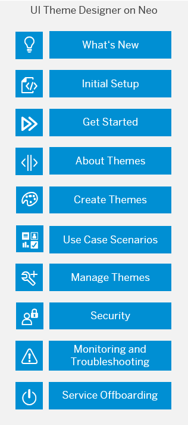

<!-- loiob7dc059452ac4054b0d7e46b813b301c -->

<link rel="stylesheet" type="text/css" href="css/sap-icons.css"/>

# UI Theme Designer for the Neo Environment

This guide describes how to use the UI theme designer in the Neo environment.

> ### Tip:  
> The English version of this guide is open for contributions and feedback using GitHub. This allows you to get in contact with responsible authors of SAP Help Portal pages and the development team to discuss documentation-related issues. To contribute to this guide, or to provide feedback, choose the corresponding option on SAP Help Portal:
> 
> -   :pencil2:: Contribute to a documentation page. This option opens a pull request on GitHub.
> 
> -    Feedback: Provide feedback about a documentation page. This option opens an issue on GitHub.
> 
> 
> You need a GitHub account to use these options.
> 
> More information:
> 
> -   [Contribution Guidelines](https://help.sap.com/docs/open-documentation-initiative/contribution-guidelines/readme.html)
> 
> -   [Introduction Video: Open Documentation Initiative](https://www.youtube.com/watch?v=WJ0oarMlVW4)
> 
> -   [Blog Post: Introducing the Open Documentation Initiative](https://blogs.sap.com/2021/05/20/introducing-the-open-documentation-initiative/)

