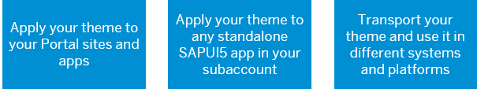

<!-- loio87e746249270429c8eedcb5d1cb17201 -->

# Use Case Scenarios

Themes created in the UI theme designer can be used in various scenarios.

You have created a custom theme by basing it on one of SAP’s out-of-the-box themes.

For more information, see [Create Themes - End to End Flow](create-themes-end-to-end-flow-756feb8.md).

In this section, we will tell you about the different use case scenarios - how you can use the themes you created in the UI theme designer to brand your site and the apps in it, how you can assign themes to standalone apps in your subaccount, and how you can export themes that you created in your cloud system and import them into another on premise system.

For more information, hover over the shapes below, click them for more details.

